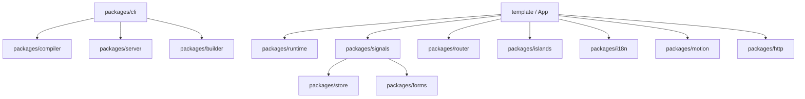

# 🚀 Nova Framework - Monorepo Packages & Usage Guide

Chào mừng bạn đến với tài liệu hướng dẫn chi tiết về cấu trúc Monorepo và cách sử dụng các gói thư viện (packages) trong **Nova Framework** - một framework frontend siêu hiệu năng dành cho các ứng dụng Web hiện đại.

Tài liệu này bao gồm phân tích chi tiết của **14 gói thư viện cốt lõi** nằm trong thư mục [packages/](file:///d:/framework/packages) cùng với các ví dụ thực tế và cách phối hợp sử dụng chúng.

---

## 📌 Tổng quan Kiến trúc Gói (Monorepo Architecture)

Nova Framework được phát triển theo kiến trúc monorepo phân rã cao (highly decoupled), giúp tối ưu hóa hiệu năng tải trang thông qua kiến trúc **Islands Architecture** (Thuỷ văn hoá cục bộ) kết hợp với hệ thống phản ứng **Signals** cực kỳ nhẹ nhàng.



---

## 📂 Danh sách & Cách sử dụng các Gói (Packages)

### 1. `@nova/runtime` (Core JSX Engine)
* **Thư mục**: [packages/runtime](file:///d:/framework/packages/runtime)
* **Chức năng**: Trái tim của framework, cung cấp JSX runtime tương thích với cấu trúc DOM thực tế (Vanilla DOM) thay vì sử dụng Virtual DOM nặng nề. Nó định nghĩa hàm `createElement` và `Fragment` dùng để render giao diện, và `createTemplate` để tăng tốc nhân bản nút DOM tĩnh.
* **Cách sử dụng**:
  ```tsx
  import { createElement, Fragment } from '@nova/runtime';

  export function Counter() {
    return (
      <>
        <div class="card">
          <h3>Hello Nova!</h3>
        </div>
      </>
    );
  }
  ```

---

### 2. `@nova/signals` (State Reactivity & Pipes)
* **Thư mục**: [packages/signals](file:///d:/framework/packages/signals)
* **Chức năng**: Hệ thống quản lý trạng thái phản ứng dựa trên **Signal** (tương tự SolidJS/Preact). Hỗ trợ Angular-style **Pipes** (ví dụ: `uppercase`, `lowercase`, `date`) trực tiếp bên trong biểu thức JSX thông qua cơ chế lọc biến đổi cú pháp đặc biệt.
* **Cách sử dụng**:
  ```tsx
  import { signal, computed, definePipe } from '@nova/signals';

  // 1. Khai báo Signal
  const count = signal(0);
  const double = computed(() => count.value * 2);

  // 2. Định nghĩa một custom Pipe
  export const greetPipe = definePipe({
    name: 'greet',
    transform(val: string) {
      return `Xin chào, ${val}!`;
    }
  });

  // 3. Sử dụng trong JSX (Hỗ trợ cú pháp Pipe tự động dịch)
  export function Profile() {
    const name = signal('Nova User');
    return (
      <div>
        <p>Gấp đôi: {() => double.value}</p>
        {/* Pipe greet chuyển đổi nội dung */}
        <span>{() => name.value | greet}</span>
        <button onClick={() => count.value++}>Tăng</button>
      </div>
    );
  }
  ```

---

### 3. `@nova/store` (Centralized State Management)
* **Thư mục**: [packages/store](file:///d:/framework/packages/store)
* **Chức năng**: Trình quản lý trạng thái tập trung toàn cục (Global State Store) tương tự Pinia trong Vue. Hỗ trợ tự động đồng bộ xuống `LocalStorage` (persistence) để lưu trữ trạng thái người dùng.
* **Cách sử dụng**:
  ```typescript
  import { defineStore } from '@nova/store';

  export const useUserStore = defineStore('user', {
    state: () => ({
      name: 'Guest',
      isLoggedIn: false
    }),
    getters: {
      welcomeMessage: (state) => `Chào mừng ${state.name}!`
    },
    actions: {
      login(this: any, username: string) {
        this.name = username;
        this.isLoggedIn = true;
      },
      logout(this: any) {
        this.name = 'Guest';
        this.isLoggedIn = false;
      }
    },
    persist: true // Tự động lưu trữ và đồng bộ với LocalStorage
  });
  ```

---

### 4. `@nova/router` (File-based Client Router)
* **Thư mục**: [packages/router](file:///d:/framework/packages/router)
* **Chức năng**: Bộ định tuyến Client-side nhẹ. CLI tự động quét thư mục `src/pages` để đăng ký bảng Route và hỗ trợ chuyển trang mượt mà không tải lại toàn bộ trang (Single Page Application).
* **Cách sử dụng**:
  ```tsx
  import { router } from '@nova/router';

  export function Sidebar() {
    return (
      <nav>
        {/* Chuyển trang có kiểm soát tránh reload */}
        <a href="/" onClick={(e) => { e.preventDefault(); router.navigate('/'); }}>Trang chủ</a>
        <a href="/settings" onClick={(e) => { e.preventDefault(); router.navigate('/settings'); }}>Cài đặt</a>
      </nav>
    );
  }
  ```

---

### 5. `@nova/islands` (Partial Hydration Splitter)
* **Thư mục**: [packages/islands](file:///d:/framework/packages/islands)
* **Chức năng**: Cốt lõi của kiến trúc **Island Architecture**. Nó đánh dấu, phân tách và tự động "thuỷ văn hoá" (hydration) các phần giao diện tương tác động trên Client trong khi giữ phần lớn trang HTML tĩnh để đạt điểm số SEO và Performance tối đa.
* **Cách sử dụng**:
  ```tsx
  import { registerIsland } from '@nova/islands';
  import { signal } from '@nova/signals';

  export function InteractiveMap() {
    const zoom = signal(10);
    return (
      <div class="map-island" data-island="interactivemap">
        <button onClick={() => zoom.value++}>Zoom In</button>
      </div>
    );
  }

  // Đăng ký Hydration client-side
  registerIsland('interactivemap', () => Promise.resolve({ default: InteractiveMap }));
  ```

---

### 6. `@nova/compiler` (AST Transformer)
* **Thư mục**: [packages/compiler](file:///d:/framework/packages/compiler)
* **Chức năng**: Biên dịch code TSX/JSX của bạn thành code JavaScript tối ưu hóa tối đa. Nó phân tích cây cú pháp AST của TypeScript để tìm các nút tĩnh rồi tự động nâng chúng lên phạm vi module (Hoisting), đồng thời chuyển đổi cú pháp directive (`n-if`, `n-for`, `n-router`) và `Pipes` thành các lời gọi API DOM vanilla siêu tốc.
* **Cách hoạt động**:
  * Chuyển đổi `<div n-if={isVisible}>` thành `() => isVisible.value ? createElement('div') : null`.
  * Chuyển đổi `<li n-for="item in items">` thành `() => items.value.map(item => ...)`.

---

### 7. `@nova/cli` (Development & Generation Utility)
* **Thư mục**: [packages/cli](file:///d:/framework/packages/cli)
* **Chức năng**: Giao diện dòng lệnh (Command Line Interface). Cung cấp máy chủ phát triển cực nhanh tích hợp Hot Module Replacement (HMR) và hệ thống sinh code tự động (Scaffolding).
* **Các lệnh chính (chạy qua `npm run` hoặc `npx nova`)**:
  * `npx nova dev`: Khởi động dev server có HMR kèm tính năng bắt và báo lỗi cú pháp đỏ rực trực tiếp ở terminal.
  * `npx nova build`: Đóng gói tối ưu hóa mã nguồn sẵn sàng đưa lên production.
  * `npx nova g island <Name>`: Tự động sinh thư mục Hydrated Island mới.
  * `npx nova g store <Name>`: Tạo nhanh một Store quản lý trạng thái.
  * `npx nova g route <Name>`: Tạo trang page route mới.

---

### 8. `@nova/builder` (Bundler Wrapper)
* **Thư mục**: [packages/builder](file:///d:/framework/packages/builder)
* **Chức năng**: Cấu hình đóng gói nâng cao, bọc quanh `esbuild` để thực hiện gom tệp (bundling), giảm kích thước tệp (minifying), và xuất báo cáo phân tích dung lượng bundle (analysis) khi build cho môi trường Production.

---

### 9. `@nova/forms` (Reactive Form Validation)
* **Thư mục**: [packages/forms](file:///d:/framework/packages/forms)
* **Chức năng**: Quản lý biểu mẫu và ràng buộc dữ liệu đầu vào. Hỗ trợ cơ chế bắt lỗi động (validation) thời gian thực bằng các Rule trực quan.
* **Cách sử dụng**:
  ```typescript
  import { FormControl, FormGroup, Validators } from '@nova/forms';

  // 1. Tạo form group
  const loginForm = new FormGroup({
    email: new FormControl('', [Validators.required, Validators.email]),
    password: new FormControl('', [Validators.required, Validators.minLength(6)])
  });

  // 2. Kiểm tra trạng thái
  if (loginForm.valid) {
    console.log('Dữ liệu hợp lệ:', loginForm.value);
  } else {
    console.log('Lỗi email:', loginForm.get('email').errors);
  }
  ```

---

### 10. `@nova/i18n` (Multi-language Support)
* **Thư mục**: [packages/i18n](file:///d:/framework/packages/i18n)
* **Chức năng**: Đa ngôn ngữ (Internationalization) siêu nhẹ, hỗ trợ thay đổi ngôn ngữ ngay lập tức mà không gây giật lag nhờ khả năng cập nhật trạng thái hạt nhân (fine-grained updates).
* **Cách sử dụng**:
  ```tsx
  import { useTranslation, initTranslations } from '@nova/i18n';

  // Khởi tạo từ điển ngôn ngữ
  initTranslations({
    vi: { welcome: 'Chào mừng!' },
    en: { welcome: 'Welcome!' }
  });

  export function Header() {
    const { t, locale } = useTranslation();
    return (
      <header>
        <h1>{() => t('welcome')}</h1>
        <button onClick={() => locale.value = 'en'}>English</button>
        <button onClick={() => locale.value = 'vi'}>Tiếng Việt</button>
      </header>
    );
  }
  ```

---

### 11. `@nova/motion` (Smooth Animations Engine)
* **Thư mục**: [packages/motion](file:///d:/framework/packages/motion)
* **Chức năng**: Hệ thống hoạt ảnh mượt mà 60FPS. Cung cấp API động để tạo chuyển động nhảy trang, ẩn hiện, hoặc biến đổi phần tử.
* **Cách sử dụng**:
  ```tsx
  import { AnimatePresence, motion } from '@nova/motion';
  import { signal } from '@nova/signals';

  export function Popover() {
    const isOpen = signal(false);
    return (
      <div>
        <button onClick={() => isOpen.value = !isOpen.value}>Toggle</button>
        <AnimatePresence>
          {() => isOpen.value && (
            <div 
              class="box"
              style={motion.fade({ duration: 0.3 })} // Hoạt ảnh Fade-in
            >
              Nội dung hộp!
            </div>
          )}
        </AnimatePresence>
      </div>
    );
  }
  ```

---

### 12. `@nova/http` (Modern HTTP Client)
* **Thư mục**: [packages/http](file:///d:/framework/packages/http)
* **Chức năng**: Trình khách gọi API (HTTP Client) xây dựng trên nền tảng Fetch API. Hỗ trợ interceptor (đánh chặn để thêm token), xử lý timeout, tự động parse JSON và cơ chế Retry tự động.
* **Cách sử dụng**:
  ```typescript
  import { http } from '@nova/http';

  interface User {
    id: number;
    name: string;
  }

  async function fetchUsers() {
    try {
      const users = await http.get<User[]>('https://api.example.com/users', {
        headers: { Authorization: 'Bearer token123' },
        timeout: 5000 // Hủy kết nối nếu quá 5 giây
      });
      console.log('Danh sách users:', users);
    } catch (error) {
      console.error('Lỗi tải dữ liệu:', error);
    }
  }
  ```

---

### 13. `@nova/plugins` (Extension System Hooks)
* **Thư mục**: [packages/plugins](file:///d:/framework/packages/plugins)
* **Chức năng**: Bộ quản lý plugin của Dev Server và Compiler. Cung cấp hệ thống lifecycle hooks (như `beforeCompile`, `transform`, `afterCompile`, `afterSSR`, `beforeBuild`) giúp các nhà phát triển dễ dàng mở rộng và can thiệp vào quá trình xử lý mã nguồn của ứng dụng.

---

### 14. `@nova/server` (Core Production Server Engine)
* **Thư mục**: [packages/server](file:///d:/framework/packages/server)
* **Chức năng**: Máy chủ Node.js hiệu năng cao dùng để phân phối các tệp tĩnh, cấu hình CORS, gzip nén dữ liệu, và hỗ trợ routing SPA fallback cho môi trường production khi đưa ứng dụng lên các Cloud hosting VPS.

---

## 🛠️ Hướng dẫn quy trình phát triển trong Monorepo

Khi làm việc trong môi trường Monorepo của Nova, bạn hãy ghi nhớ các lệnh quan trọng chạy từ **thư mục gốc** (`d:\framework`):

1. **Biên dịch lại toàn bộ các Gói**:
   ```bash
   npm run build
   ```
   *Lệnh này sẽ chạy trình biên dịch TypeScript (`tsc`) cho tất cả 14 packages theo thứ tự phụ thuộc chính xác.*

2. **Khởi động dự án Template để phát triển**:
   * Di chuyển vào thư mục template: `cd template`
   * Khởi động dev server cục bộ: `npm run dev` *(hoặc `npx nova dev`)*.
   * Lợi ích: Bất kỳ thay đổi nào trong `src/` của template sẽ kích hoạt HMR cập nhật tức thì. Nếu có lỗi cú pháp, terminal sẽ báo lỗi **ĐỎ RỰC** ngay trên màn hình để bạn xử lý!

3. **Chạy các bộ Test Suite**:
   ```bash
   npm run test
   ```
   *Được tích hợp sẵn Vitest để đảm bảo tính ổn định tối đa cho tất cả gói tính năng trước khi release.*

---

*Tài liệu này được biên soạn đầy đủ và cập nhật mới nhất cho dự án Nova Framework của bạn. Chúc bạn có trải nghiệm lập trình tuyệt vời cùng Nova!*
